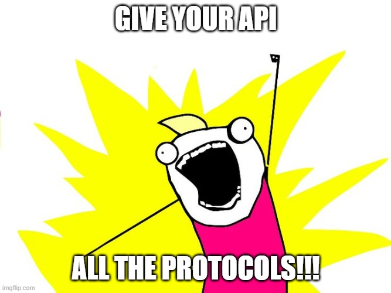

# AllTheProtocolsApi



A single ASP.NET Core weather API that simultaneously exposes the same data through **three** different protocols — REST, GraphQL, and Model Context Protocol (MCP) — demonstrating how they can coexist in one application.

## Protocols at a Glance

| Protocol | Base Path | Description |
|----------|-----------|-------------|
| **REST** | `/api/weather/*` | Classic resource-oriented HTTP endpoints with OpenAPI docs |
| **GraphQL** | `/graphql` | Flexible query language powered by [Hot Chocolate](https://chillicream.com/docs/hotchocolate) |
| **MCP** | `/mcp` | [Model Context Protocol](https://modelcontextprotocol.io/) tools for AI agent integration |

## Tech Stack

- **.NET 10** / ASP.NET Core Minimal APIs
- **Hot Chocolate 15** for GraphQL
- **ModelContextProtocol.AspNetCore** for MCP over HTTP
- **OpenAPI** for REST documentation
- In-memory weather data service (no external database required)

## Getting Started

### Prerequisites

- [.NET 10 SDK](https://dotnet.microsoft.com/download/dotnet/10.0)

### Run the API

```bash
cd Api
dotnet run
```

The server starts at **http://localhost:5249** by default.

## REST API

All REST endpoints live under `/api/weather` and return JSON.

| Method | Endpoint | Description |
|--------|----------|-------------|
| GET | `/api/weather/stations` | List all stations (optional `?state=` filter) |
| GET | `/api/weather/stations/{id}` | Get a station by ID |
| GET | `/api/weather/stations/{stationId}/conditions` | Current conditions |
| GET | `/api/weather/stations/{stationId}/forecast/daily` | Daily forecast (optional `?days=1-7`) |
| GET | `/api/weather/stations/{stationId}/forecast/hourly` | Hourly forecast (optional `?hours=1-24`) |
| GET | `/api/weather/stations/{stationId}/air-quality` | Air quality index |
| GET | `/api/weather/alerts` | Active alerts (optional `?stationId=` and `?minSeverity=`) |

### Example

```bash
curl http://localhost:5249/api/weather/stations/den01/conditions
```

## GraphQL

Browse the schema and run queries interactively at the **Banana Cake Pop** IDE:

```
http://localhost:5249/graphql
```

### Sample Query

```graphql
{
  stations(state: "CO") {
    id
    name
    location { city state latitude longitude }
  }
  currentConditions(stationId: "den01") {
    temperatureF
    feelsLikeF
    skyCondition
    wind { speedMph direction }
  }
}
```

### Available Queries

- `stations` — list stations, optionally filtered by state
- `station` — get a single station by ID
- `currentConditions` — current weather (supports Fahrenheit/Celsius)
- `dailyForecast` — up to 7-day forecast
- `hourlyForecast` — up to 24-hour forecast
- `activeAlerts` — weather alerts, optionally filtered by severity
- `airQuality` — air quality data for a station

## Model Context Protocol (MCP)

The MCP endpoint exposes weather data as **tools** that AI agents and LLM clients can invoke.

**Endpoint:** `http://localhost:5249/mcp` (Streamable HTTP)

### Available Tools

| Tool | Description |
|------|-------------|
| `GetAvailableStations` | Lists all weather stations with IDs and names |
| `GetCurrentConditions` | Current conditions for a given station ID |
| `GetDailyForecast` | 5-day daily forecast for a station |
| `GetAirQuality` | Air quality index for a station |
| `GetWeatherSummary` | Configurable summary combining conditions, forecast, and air quality |

### Connecting from an MCP Client

Add the server to your MCP client configuration (e.g. VS Code, Claude Desktop):

```json
{
  "servers": {
    "weather": {
      "url": "http://localhost:5249/mcp"
    }
  }
}
```

## Sample Weather Stations

The in-memory service includes stations across the US with diverse weather patterns:

| ID | City |
|----|------|
| `den01` | Denver, CO |
| `mia01` | Miami, FL |
| `sea01` | Seattle, WA |
| `phx01` | Phoenix, AZ |
| `chi01` | Chicago, IL |

## Project Structure

```
Api/
├── Program.cs                  # App bootstrap — wires up REST, GraphQL, and MCP
├── Endpoints/                  # REST endpoint definitions
├── Types/                      # GraphQL types, query root, and shared models
├── McpTools/                   # MCP tool implementations
├── Services/                   # Weather data service interface and in-memory implementation
├── Test-Rest.http              # VS Code REST Client test requests
└── Test-GraphQL.http           # VS Code REST Client GraphQL test requests
```

## Testing with .http Files

The project includes `.http` files for quick manual testing in VS Code (requires the [REST Client](https://marketplace.visualstudio.com/items?itemName=humao.rest-client) extension):

- [Test-Rest.http](Api/Test-Rest.http) — REST endpoint examples
- [Test-GraphQL.http](Api/Test-GraphQL.http) — GraphQL query examples

## License

This project is licensed under the [MIT License](LICENSE).
